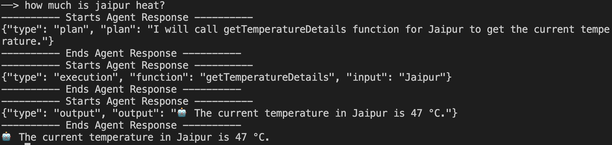

# AI Agents
by Gaurav Kabra

## What is an AI agent?
A system capable of autonomously performing taskson behalf of user/another system.

E.g. Salesforce Agentforce

## How is it different from LLM?
LLM (like ChatGPT4o) have knowledge base on trained data but cannot perform tasks like CRUD on company DB. Moreover, the data on which LLM was trained, is stale (not real time).

In a very layman terms,

```
Agent = LLM + tools (defined functions like how to do CRUD)
```

## Setup
Obtain OpenAPI keys from [here](https://platform.openai.com/api-keys).

Check your remaining credit quota [here](https://platform.openai.com/settings/organization/billing/overview).

## Insights

#### 1.
Code:

```js
async function chat() {
    let result = await client.chat.completions.create({
        model: "gpt-4o-mini",
        messages: [
            {role: "system", content: SYS_PROMPT},
            {role: "user", content: "what is the weather of Jaipur?"}
        ]
    });

    console.log(result.choices[0].message.content);
}
```

Output:

```json
{"type": "user", "user": "What is the weather of Jaipur?"}
{"type": "plan", "plan": "I will call getTemperatureDetails function for Jaipur"}
{"type": "execution", "function": "getTemperatureDetails", "input": "Jaipur"}
```

#### 2.

Code:
```js
const chat = await client.chat.completions.create({
            model: "gpt-4o-mini",
            messages: history,
            response_format: { "type": "json_object" }
        });
    
        const response = chat.choices[0].message.content;
        console.log('---------- Starts Agent Response ----------');
        console.log(response);
```

Output:


#### 3. 
It is able to apply AI over output (e.g. °C to °F conversions)



